# Weka workbench - Data mining project

- Dataset - [lung cancer](https://www.kaggle.com/datasets/fedesoriano/covid19-effect-on-liver-cancer-prediction-dataset);

## Classification

- Treniranje ML modela da prepozna kolika je sansa da pacijent ima rak - viseklasna klasifikacija, atribut `Level` - `Low`/`Medium`/`High`

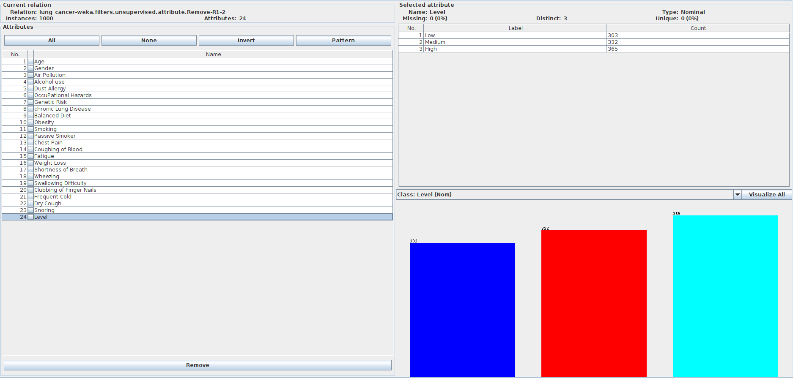

### ZeroR

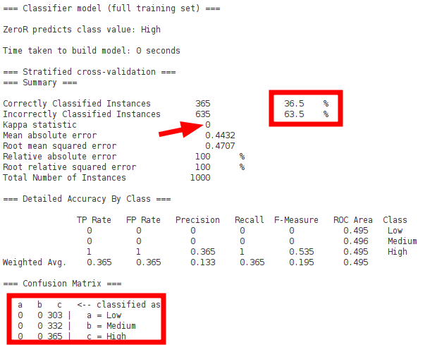

### OneR

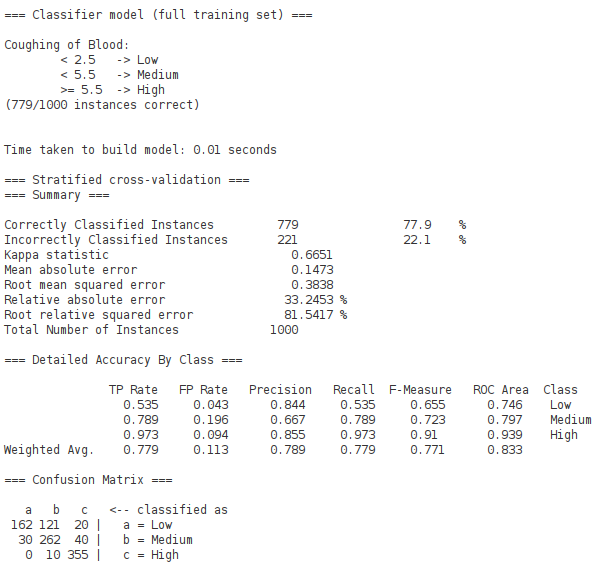

### Naive Bayes

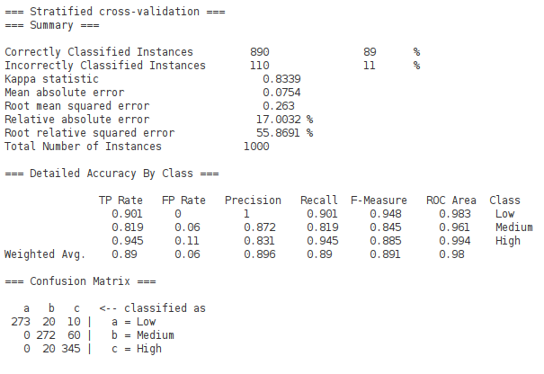

### J48 - Pruned

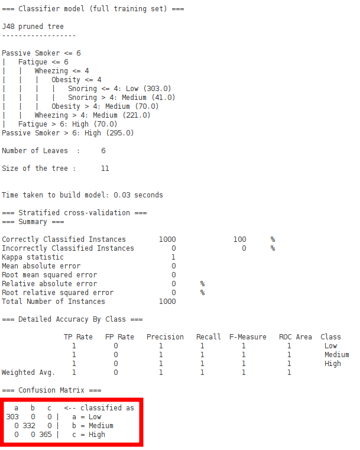

Stablo:

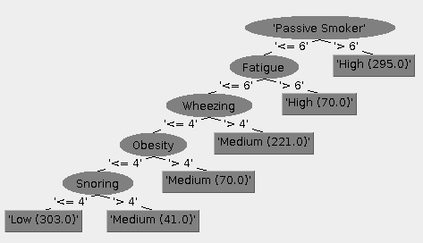

### kNN

#### k = 1

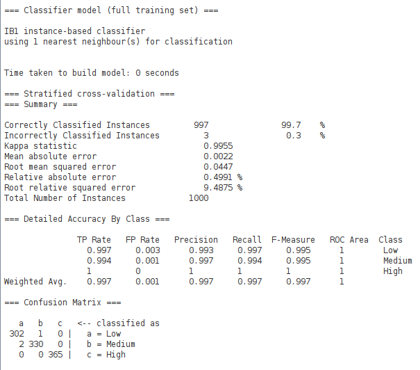

#### k = 3

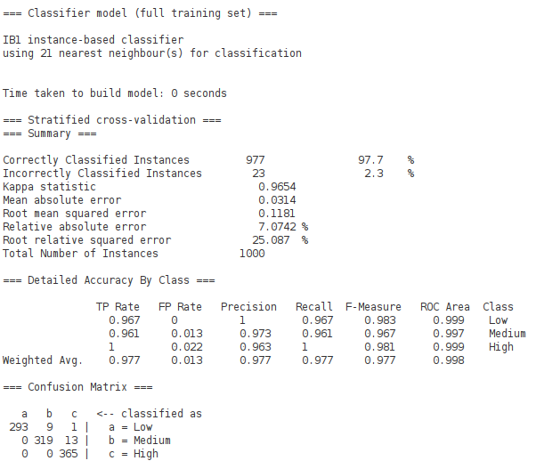

#### k = 21

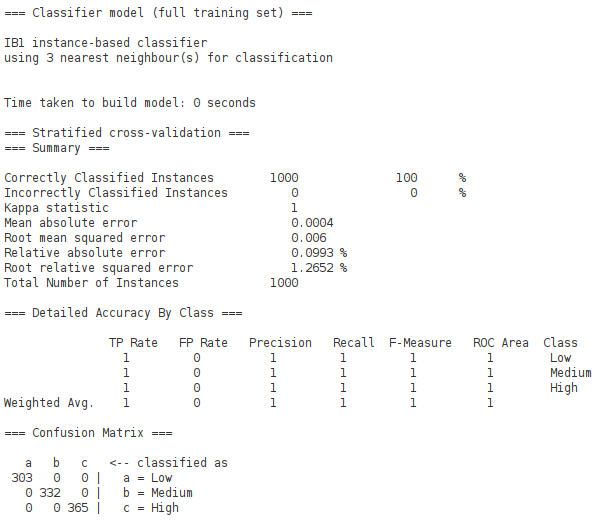

## Linear regression

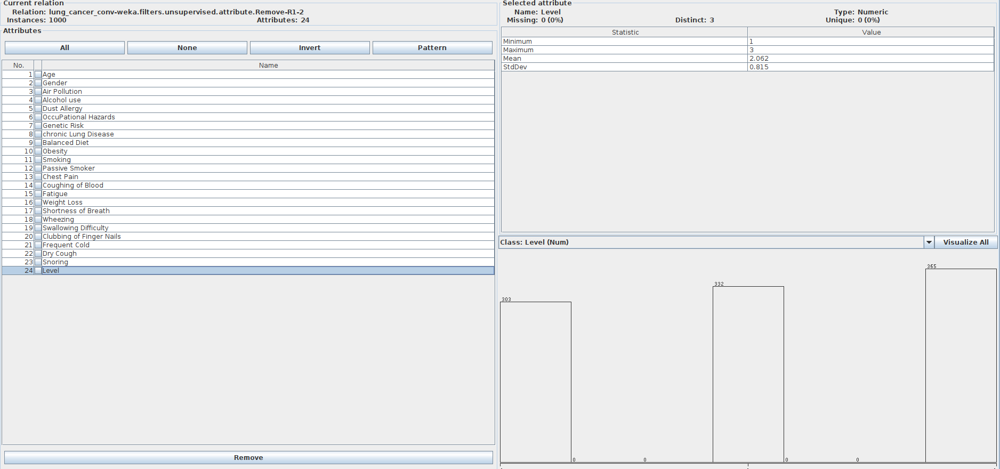

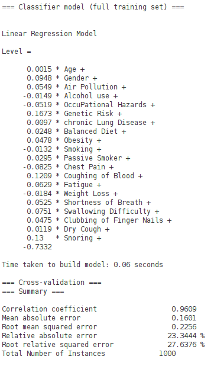

### Re-evaluation on a test set

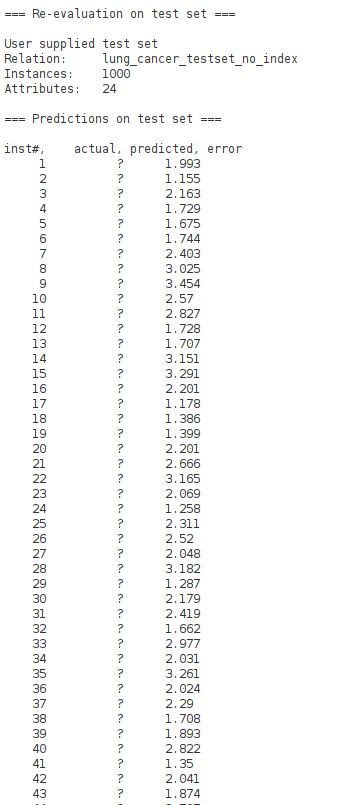

## Clusterization

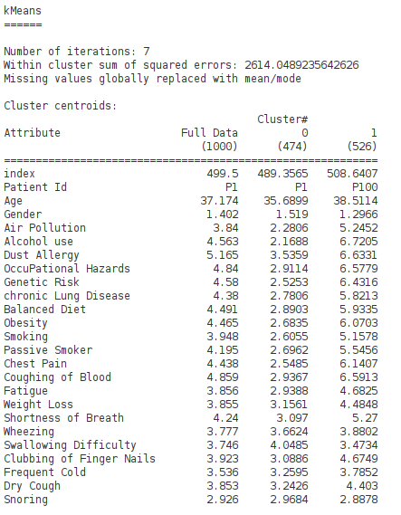

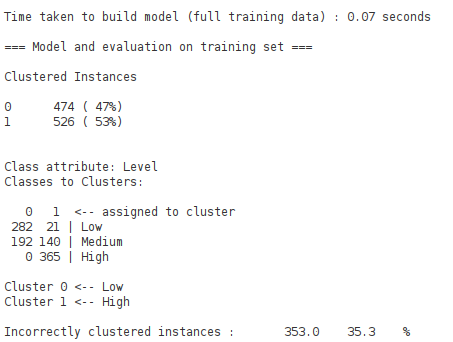
